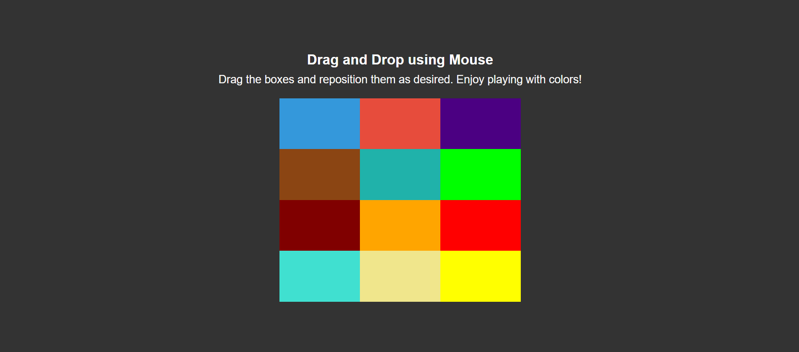
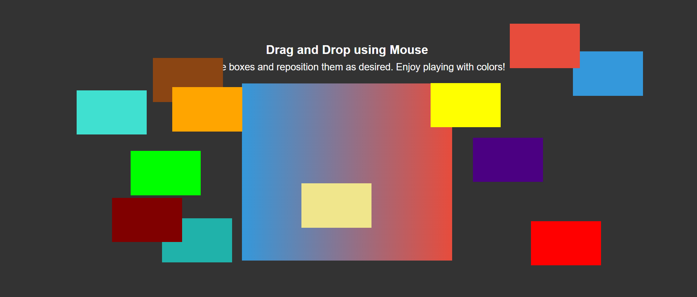

# Drag and Drop using Mouse

This project is a simple drag-and-drop game where users can interactively move colored boxes around the screen. The goal is to enhance the visual layout and enable users to play with different box colors in a fun and engaging way.

## Features

- **Drag and reposition colored boxes**: Users can click and drag the boxes to move them freely.
- **Visually appealing design**: Larger box sizes and vibrant colors make the interface more engaging.
- **Accessible**: ARIA labels ensure better accessibility for screen readers.
- **Smooth animations**: Transition effects enhance the user experience as boxes are dragged and dropped.
- **Customizable**: Easily extend the colors and layout to fit different use cases.

## Screenshots

### 1. Simple View:

### 2. Dragging Interaction:

## How It Works

1. **Drag and Drop**:  
   - Simply click and drag any box to reposition it within the container.
   - Each box has a unique color, making it visually distinguishable.
   
2. **Color Change on Hover**:  
   - Boxes change color when hovered, providing a feedback loop that improves interaction.

3. **Accessibility**:  
   - ARIA labels have been added for screen readers, ensuring that the drag-and-drop functionality is accessible.

## Customization

- **Box Colors**: The box colors are customizable in the `style.css` file. You can modify the background colors to match your theme.
- **Box Sizes**: The box dimensions can be adjusted as needed to better fit different screen sizes or design requirements.
- **Container Styles**: If you need a different container layout or design, feel free to update the `container` and `box` classes.

## Troubleshooting

- **Boxes not dragging**: Ensure that your browser supports drag-and-drop functionality.
- **Styling issues**: Double-check the CSS styles for proper box sizing and positioning.
- **JavaScript errors**: Make sure the `script.js` file is correctly linked and loaded in your HTML.
-----

Contributions are welcome! If you find any issues or want to add new features, feel free to fork this repository and submit a pull request.

